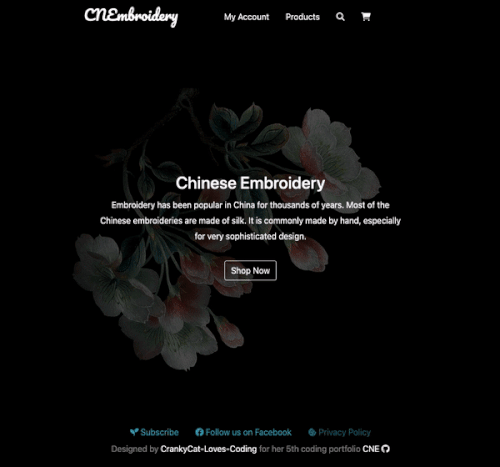
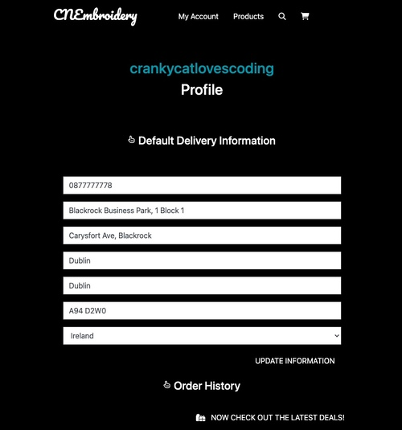
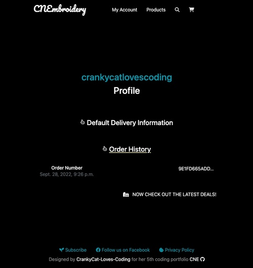

# [**CNEbroidery**](https://https://cnembroidery.herokuapp.com/)

## **Overview**

This is an e-commerce web application complete with product search and filter functionality. A live fully functional payment system. A full-featured authentication system including email confirmations and user profiles. And real-time notifications that guide the user's experience. The website was built in modern software development Such as Stripe, Amazon Web Services, Heroku, and more.

## **Table of Contents**

- [**CNEbroidery**](#overview)
  - [**Overview**](#overview)
  - [**Table of Contents**](#table-of-contents)
    - [**1. What Is It?**](#1-what-is-it)
    - [**2. How to Achieve?**](#2-how-to-achieve)
    - [**3. Testing and Launch**](#3-testing-and-launch)
    - [**4. Deployment**](#4-deployment)
    - [**5. Support**](#5-support)
    - [**6. Reference and Research**](#6-reference-and-research)

### **1. What Is It?**

- CNEbroidery
[Details of Ebroidery described on Wiki](https://en.wikipedia.org/wiki/Chinese_embroidery)

The name CNEbroidery is a combanation of 'CN' and 'Ebroidery', Chinese Ebroidery has been popular in China for thousands of years，most of the Chinese embroideries are made of silk. It is commonly made by hand, especially for very sophisticated design. It's considered as one of best gifts or collections. This website is built to introduct Chinese Ebroidery and sell high quality Chinese Ebroidery. 

[Back to the top](#overview)

### **2. How to Achieve?**

- **User View**

  

  - Nav bar
    - ***CNEbroidery***: clicking website name will be redirected back to the home page.
    - ***My account***: allowing users to login or sign up. This is built by using a popular pre-built package called Django-allauth. It's an open-source and believed to be secure and maintaind up-to-date. It's also easy to add more functionality to it.

    
    
    - ***Products***: users can access product page by clicking 'shop now' button or via nav product link. It contains all links for products and categories. There are three categories which are Decoration, Fashion and Offers.

    

    - ***Search engine and sorting products***: users are able to search from the entire site or sort by product size from small to big or sort by product price from low to high.
    - ***Cart (bag model)***: the color of cart icon will change to blue if users have added any items to cart. The total amount of shopping also available there. Clicking 'View Cart' will direct our users to cart detail page.

  - Footer
    - ***Subscribe***: users can enter an email to subscribe monthly newsletter to get exclusive offers and discount codes.
    - ***Facebook Social Link***: Facebook is used to build a community and deepening relationships with customers to encourage interest and customer loyalty.
    - ***Privacy Policy***: Privacy Policy to display to make sure that business complies with the law.

- My account
  - ***Sign up***:
    A confirmation email will be sent to registered email and a page instructing how to complete the registration is displayed. Once the user confirm registered email then personal profile will be created successfully.

    

  - ***Profile (UserProfile model)***:
    User has a personalized user profile. They can edit and save their information via the profile page. User can also check their order history via this page.

     
    

    - ***Products***: all products page contain product image, product name, product category, product size, product price. Click on 'Details' bottom will be redirected to product detail page which will show description of the product and a bottom to add to cart. 

    - ***Payment***: Stripe is used to collect payment. Order confirmation email will be sent after user completed payment. User will be able to view order summary at the check-out-success page.

    

- Product management
- ***Add a product***:
  A user who is authenticated super user will be able to add, edit and remove an item. Adding a product can be access though "My Account" then "Product Management".

- ***Edit and remove a product***:
  Editing and removing option will be display is user is authenticated.

  

- **Program flow chart**

    

    Firstly, the program obtains the player’s name and then greets the player.
    Secondly, the program asks the question “Would you like to play to play?” and takes input from the player to determine if the game continues or stops. If the player enters ‘n’, then the game is terminated. At the same time print out a goodbye message to the player. If the player enters ‘y’, then the game starts.
    The program displays rules after the input ‘y’ is identified and guides the player to make a move by entering 'r' for Rock, 'p' for Paper or 's' for Scissors.

    If the player wins, the computer displays a message and a partial image. Once the player has won 3 times, the computer displays a full image. Then the player is asked if they wish to replay the game or exit the game.

[Back to the top](#overview)

### 3. **Testing and Launch**

- PEP8 validation

  - No errors or warnings were found when passing through the official PEP8 validator.

- Normal testing
  - The game runs smoothly with normal activities. Obtaining the player's name and capitalized the first letter correctly. Validating the player's input such as 'y' or 'n' for start or exit the game. Showing no issues for corrent moves as 'r', 'p' or 's', also image and message for tie, win or lost displayed accordingly. The game can be exited easily by enter 'n' and goodbye message displayed correctly. More details can be found as per following gif image.
  - 

- Function start() testing:
  - A bug was identified when testing on the start() function. There was a chance that a player may enter anything else other than y’ or ‘n. Hence used while…not in…: method to validate input and display a message to require the player to enter only ‘y’ or ‘n’ to start or exit the game. Then the player can exit the game by entering 'n' without any issue.
  - 

- Function play() testing:
  - The same bug fixed in play() function. The computer displays a message to the player if invalid input is identified. For example, the computer will display a message of "enter 'r' for Rock,'p' for Paper,'s' for Scissors" to the player if input identified as 'abc' where it should has been chosen 'r', 'p' or 's'.
  - 

- Function player_win( ) testing:
  - The game is designed to allow the player to win 3 times of the game. However, there was a bug where the game ended after the player has won 2 times. It was fixed by updating the n value when called the function. It needed to be 5 other than 3 because of the math.ceiling method. 

- Goodbye message testing:
  - The game terminates if the player enters ‘n’  and  Goodbye message displayed as expected.
  - 

- Technology Stack
  There is a list of tools or method had been used during the period of development:

  *Building methods*
  - [x] [Django-allauth](https://django-allauth.readthedocs.io/en/latest/installation.html)
  - [x] [Django-crispy-forms](https://django-crispy-forms.readthedocs.io/en/latest/)
  - [x] [Django-countries](https://pypi.org/project/django-countries/)
  - [x] [pillow](https://pillow.readthedocs.io/en/stable/index.html)
  - [x] [Stripe](https://stripe.com/docs/api?lang=python)
  - [x] [AWS](https://aws.amazon.com/)

  - [x] [Heroku]( https://dashboard.heroku.com/apps)
  - [x] [Privacy Policy Generator](https://www.privacypolicygenerator.info/ )

  *Validation Tools*
  - [x] [Python](https://www.python.org/)
  - [x] [PEP8](http://pep8online.com/)

  *Other*
  - [x] [Responsive design](http://ami.responsivedesign.is/#)
  - [x] [Ezgif](https://ezgif.com/)
 

[Back to the top](#overview)

### 4. **Deployment**

- The game was deployed to [Heroku]( https://dashboard.heroku.com/apps) page. The steps to deploy are as follows:

- In the Heroku page, select ‘Create new app’

- Create app name and choose a region

- Navigate to the setting tab. Add Python and node.js buildpacks

- At the deploy section, connect to Github, search and link to Rock-Paper-Scissors repository.

- Scroll down to set up automatic deploys, it enables Heroku to rebuild the app every time push code to Github.

- The live link can be found here [link]( https://rack-paper-scissors.herokuapp.com/)

[Back to the top](#overview)

### 5. **Support**

- Code Institute Tutor Assistance

  [Back to the top](#overview)

### 6. **Reference and Research**

- Reference
  - [x] [Wiki](https://www.wikipedia.org/)
  - [x] [Article 1](http://k.sina.com.cn/article_7059102645_p1a4c15bb500100hze9.html?from=cul )
  - [x] [README Basic writing and formatting syntax](https://docs.github.com/en/get-started/writing-on-github/getting-started-with-writing-and-formatting-on-github/basic-writing-and-formatting-syntax#uploading-assets)

[Back to the top](#overview)

